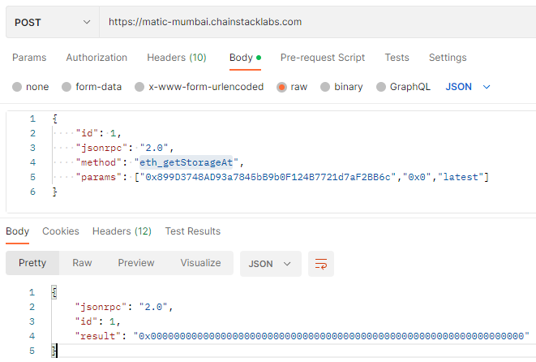
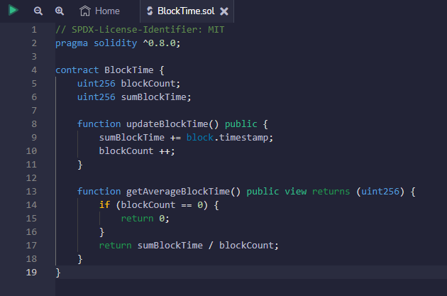

# 区块链培训作业

请大家 fork 本仓库后答题，做完后提交自己的软件仓库链接。

## 第 1 题：Solidity 语言有哪些数据类型？

例如：

-   bool
-   int8

评分标准：每个数据类型计 1 分  
参考资料： https://docs.soliditylang.org/en/latest/types.html

---

- bool
- uint
- uint8
- uint16
- uint24
- uint32
- uint256
- int8
- int16
- int24
- int32
- int256
- address
- bytes1
- bytes2
- bytes3
- bytes32
- bytes
- string
- enum
- function
- struct
- mapping

## 第 2 题：列举并测试以太坊的 JSONRPC API。

评分标准：每条有效的（提供文本命令和测试截图） API 计 2 分，例如：

---

第 1 个 API： net_version

```shell
curl -s -X POST -H "Content-Type: application/json" https://matic-mumbai.chainstacklabs.com \
-d '{"id":1,"jsonrpc":"2.0","method":"net_version","params":[]}' | jq
```


---

答案(参考[JSON-RPC API | ethereum.org](https://ethereum.org/en/developers/docs/apis/json-rpc/#json-rpc-methods))：

- 第 1 个 API： `web3_clientVersion`

```shell
curl --location --request POST 'https://matic-mumbai.chainstacklabs.com' \
--header 'Content-Type: application/json' \
--data-raw '{
    "id": 1,
    "jsonrpc": "2.0",
    "method": "web3_clientVersion",
    "params": []
}'
```


- 第 2 个 API： `web3_sha3`

```shell
curl --location --request POST 'https://matic-mumbai.chainstacklabs.com' \
--header 'Content-Type: application/json' \
--data-raw '{
    "id": 1,
    "jsonrpc": "2.0",
    "method": "web3_sha3",
    "params": ["0x68656c6c6f20776f726c64"]
}'
```


- 第 3 个 API： `net_listening`

```shell
curl --location --request POST 'https://matic-mumbai.chainstacklabs.com' \
--header 'Content-Type: application/json' \
--data-raw '{
    "id": 1,
    "jsonrpc": "2.0",
    "method": "net_listening",
    "params": []
}'
```


- 第 4 个 API： `net_peerCount`

```shell
curl --location --request POST 'https://matic-mumbai.chainstacklabs.com' \
--header 'Content-Type: application/json' \
--data-raw '{
    "id": 1,
    "jsonrpc": "2.0",
    "method": "net_peerCount",
    "params": []
}'
```


- 第 5 个 API： `eth_syncing`

```shell
curl --location --request POST 'https://matic-mumbai.chainstacklabs.com' \
--header 'Content-Type: application/json' \
--data-raw '{
    "id": 1,
    "jsonrpc": "2.0",
    "method": "eth_syncing",
    "params": []
}'
```


- 第 6 个 API： `eth_mining`

```shell
curl --location --request POST 'https://matic-mumbai.chainstacklabs.com' \
--header 'Content-Type: application/json' \
--data-raw '{
    "id": 1,
    "jsonrpc": "2.0",
    "method": "eth_mining",
    "params": []
}'
```


- 第 7 个 API： `eth_hashrate`

```shell
curl --location --request POST 'https://matic-mumbai.chainstacklabs.com' \
--header 'Content-Type: application/json' \
--data-raw '{
    "id": 1,
    "jsonrpc": "2.0",
    "method": "eth_hashrate",
    "params": []
}'
```


- 第 8 个 API： `eth_gasPrice`

```shell
curl --location --request POST 'https://matic-mumbai.chainstacklabs.com' \
--header 'Content-Type: application/json' \
--data-raw '{
    "id": 1,
    "jsonrpc": "2.0",
    "method": "eth_gasPrice",
    "params": []
}'
```


- 第 9 个 API： `eth_accounts`

```shell
curl --location --request POST 'https://matic-mumbai.chainstacklabs.com' \
--header 'Content-Type: application/json' \
--data-raw '{
    "id": 1,
    "jsonrpc": "2.0",
    "method": "eth_accounts",
    "params": []
}'
```


- 第 10 个 API： `eth_blockNumber`

```shell
curl --location --request POST 'https://matic-mumbai.chainstacklabs.com' \
--header 'Content-Type: application/json' \
--data-raw '{
    "id": 1,
    "jsonrpc": "2.0",
    "method": "eth_blockNumber",
    "params": []
}'
```


- 第 11 个 API： `eth_getBalance`

```shell
curl --location --request POST 'https://matic-mumbai.chainstacklabs.com' \
--header 'Content-Type: application/json' \
--data-raw '{
    "id": 1,
    "jsonrpc": "2.0",
    "method": "eth_getBalance",
    "params": ["0x899D3748AD93a7845bB9b0F124B7721d7aF2BB6c","latest"]
}'
```


- 第 12 个 API： `eth_getStorageAt`

```shell
curl --location --request POST 'https://matic-mumbai.chainstacklabs.com' \
--header 'Content-Type: application/json' \
--data-raw '{
    "id": 1,
    "jsonrpc": "2.0",
    "method": "eth_getStorageAt",
    "params": ["0x899D3748AD93a7845bB9b0F124B7721d7aF2BB6c","0x0","latest"]
}'
```



- 第 13 个 API： `eth_getTransactionCount`

```shell
curl --location --request POST 'https://matic-mumbai.chainstacklabs.com' \
--header 'Content-Type: application/json' \
--data-raw '{
    "id": 1,
    "jsonrpc": "2.0",
    "method": "eth_getTransactionCount",
    "params": ["0x899D3748AD93a7845bB9b0F124B7721d7aF2BB6c","latest"]
}'
```


- 第 14 个 API： `eth_getBlockTransactionCountByHash`

```shell
curl --location --request POST 'https://matic-mumbai.chainstacklabs.com' \
--header 'Content-Type: application/json' \
--data-raw '{
    "id": 1,
    "jsonrpc": "2.0",
    "method": "eth_getBlockTransactionCountByHash",
    "params": ["0xb072d1860e492d80b83f27c2843b249663b3c0ce37619b8a8323e97d181c3fa0"]
}'
```


- 第 15 个 API： `eth_getBlockTransactionCountByNumber`

```shell
curl --location --request POST 'https://matic-mumbai.chainstacklabs.com' \
--header 'Content-Type: application/json' \
--data-raw '{
    "id": 1,
    "jsonrpc": "2.0",
    "method": "eth_getBlockTransactionCountByNumber",
    "params": ["latest"]
}'
```


- 第 16 个 API： `eth_getUncleCountByBlockHash`

```shell
curl --location --request POST 'https://matic-mumbai.chainstacklabs.com' \
--header 'Content-Type: application/json' \
--data-raw '{
    "id": 1,
    "jsonrpc": "2.0",
    "method": "eth_getUncleCountByBlockHash",
    "params": ["0xb072d1860e492d80b83f27c2843b249663b3c0ce37619b8a8323e97d181c3fa0"]
}'
```


- 第 17 个 API： `eth_getUncleCountByBlockNumber`

```shell
curl --location --request POST 'https://matic-mumbai.chainstacklabs.com' \
--header 'Content-Type: application/json' \
--data-raw '{
    "id": 1,
    "jsonrpc": "2.0",
    "method": "eth_getUncleCountByBlockNumber",
    "params": ["latest"]
}'
```


- 第 18 个 API： `eth_getCode`

```shell
curl --location --request POST 'https://matic-mumbai.chainstacklabs.com' \
--header 'Content-Type: application/json' \
--data-raw '{
    "id": 1,
    "jsonrpc": "2.0",
    "method": "eth_getCode",
    "params": ["0x9c3C9283D3e44854697Cd22D3Faa240Cfb032889","latest"]
}'
```


- 第 19 个 API： `eth_call`

```shell
curl --location --request POST 'https://matic-mumbai.chainstacklabs.com' \
--header 'Content-Type: application/json' \
--data-raw '{
    "id": 1,
    "jsonrpc": "2.0",
    "method": "eth_call",
    "params": [
        {
            "from": "0x899d3748ad93a7845bb9b0f124b7721d7af2bb6c",
            "to": "0x9c3c9283d3e44854697cd22d3faa240cfb032889",
            "gas": "0x76c0",
            "gasPrice": "0x9184e72a000",
            "value": "0x9184e72a",
            "data": "0xd46e8dd67c5d32be8d46e8dd67c5d32be8058bb8eb970870f072445675058bb8eb970870f072445675"
        },
        "latest"
    ]
}'
```


- 第 20 个 API： `eth_estimateGas`

```shell
curl --location --request POST 'https://matic-mumbai.chainstacklabs.com' \
--header 'Content-Type: application/json' \
--data-raw '{
    "id": 1,
    "jsonrpc": "2.0",
    "method": "eth_estimateGas",
    "params": [
        {
            "from": "0x899d3748ad93a7845bb9b0f124b7721d7af2bb6c",
            "to": "0x9c3c9283d3e44854697cd22d3faa240cfb032889",
            "gas": "0x76c0",
            "gasPrice": "0x9184e72a000",
            "value": "0x9184e72a",
            "data": "0xd46e8dd67c5d32be8d46e8dd67c5d32be8058bb8eb970870f072445675058bb8eb970870f072445675"
        }
    ]
}'
```


- 第 21 个 API： `eth_getBlockByHash`

```shell
curl --location --request POST 'https://matic-mumbai.chainstacklabs.com' \
--header 'Content-Type: application/json' \
--data-raw '{
    "id": 1,
    "jsonrpc": "2.0",
    "method": "eth_getBlockByHash",
    "params": [
        "0xb072d1860e492d80b83f27c2843b249663b3c0ce37619b8a8323e97d181c3fa0",
        false
    ]
}'
```


- 第 22 个 API： `eth_getBlockByNumber`

```shell
curl --location --request POST 'https://matic-mumbai.chainstacklabs.com' \
--header 'Content-Type: application/json' \
--data-raw '{
    "id": 1,
    "jsonrpc": "2.0",
    "method": "eth_getBlockByNumber",
    "params": [
        "0x1b4",
        true
    ]
}'
```


- 第 23 个 API： `eth_getTransactionByHash`

```shell
curl --location --request POST 'https://matic-mumbai.chainstacklabs.com' \
--header 'Content-Type: application/json' \
--data-raw '{
    "id": 1,
    "jsonrpc": "2.0",
    "method": "eth_getTransactionByHash",
    "params": [
        "0x7f083e9fbf8b636ed6ed72464348d0c8796ccb81fb504d003aea9e4d836f525e"
    ]
}'
```


- 第 24 个 API： `eth_getTransactionByBlockHashAndIndex`

```shell
curl --location --request POST 'https://matic-mumbai.chainstacklabs.com' \
--header 'Content-Type: application/json' \
--data-raw '{
    "id": 1,
    "jsonrpc": "2.0",
    "method": "eth_getTransactionByBlockHashAndIndex",
    "params": [
        "0xb072d1860e492d80b83f27c2843b249663b3c0ce37619b8a8323e97d181c3fa0",
        "0x0"
    ]
}'
```


- 第 25 个 API： `eth_getTransactionByBlockNumberAndIndex`

```shell
curl --location --request POST 'https://matic-mumbai.chainstacklabs.com' \
--header 'Content-Type: application/json' \
--data-raw '{
    "id": 1,
    "jsonrpc": "2.0",
    "method": "eth_getTransactionByBlockNumberAndIndex",
    "params": [
        "0x1d951a4",
        "0x0"
    ]
}'
```


- 第 26 个 API： `eth_getTransactionReceipt`

```shell
curl --location --request POST 'https://matic-mumbai.chainstacklabs.com' \
--header 'Content-Type: application/json' \
--data-raw '{
    "id": 1,
    "jsonrpc": "2.0",
    "method": "eth_getTransactionReceipt",
    "params": [
        "0x7f083e9fbf8b636ed6ed72464348d0c8796ccb81fb504d003aea9e4d836f525e"
    ]
}'
```


## 第 3 题：同一个合约里代码相同的函数，为什么 GAS 费不同？

请用 Remix 验证在同一个合约里，名称不同、代码相同的函数的 GAS 费不相等，并解释原因。

评分标准：

-   验证成功： 10 分，对过程要截图
-   解释正确： 10 分

---

代码：


执行 `setVal(2)`:


执行 `setVal1(2)`:


解释：可能是调用时机不一样，或者网络繁忙程度导致的 GAS 价格变化。

## 第 4 题：用 Remix 部署校验合约

用 Remix 写一个合约，部署到 mumbai 链上，计算 mumbai 链的最近平均出块时间，并校验合约代码。

评分标准：

-   代码正确：截图 10 分
-   部署成功：截图 10 分
-   代码校验：截图 5 分
-   获取结果：截图 5 分

---

代码：



部署：


校验：


结果：


## 第 5 题：黑名单 ERC20 合约

### 5.1 修复 BlacklistTokenFactory 合约里的 bug

命令 `yarn deploy:mumbai` 会在 mumbai 链上部署 BlacklistTokenFactory 和一个 BlacklistToken 合约（简称 BT1 ），地址保存在 deploy/deployed/mumbai.json 文件里（提示：删除该文件可以重新部署）。请在区块链浏览器上调用 BlacklistTokenFactory 合约里的 createBlacklistToken 函数，动态创建一个 BlacklistToken 合约（简称 BT2 ）， BT2 的地址保存在 BlacklistTokenFactory 的 blacklistTokens 数组里，也可以在交易里的 CreateBlacklistToken 事件里查看 BT2 的地址。因为目前 BlacklistTokenFactory 合约里有 bug，导致 `yarn test` 报告某些测试用例失败。请在区块链浏览器上比较 BT1 和 BT2 的功能，找出 BT2 功能异常的问题现象。并尝试修复合约 contracts/BlacklistTokenFactory.sol 的代码，能通过文件 test/BlacklistTokenFactory.test.js 里全部的自动化测试。

评分标准：

-   找到问题现象： 截图 10 分
-   解释问题原因： 10 分
-   修改合约代码： 20 分
-   自动化测试全部通过： 10 分

### 5.2 优化 BlacklistTokenFactory.test.js

参考： https://hardhat.org/tutorial/testing-contracts , 使用 loadFixture 重构 test/BlacklistTokenFactory.test.js 文件。

评分标准： 30 分

---

已修改，详见 [commit 详情](https://github.com/heruns/demo-erc20/commit/c52db42c66873862d57010cb98c86bdac17571e9) 或 [test/BlacklistTokenFactory.test.js](./test/BlacklistTokenFactory.test.js)

### 5.3 增强 BlacklistToken 合约的功能

修改本代码仓库里的 BlacklistToken 合约代码，在转账的时候抽取 10% 的手续费，并把被扣除的手续费转给合约的创建者。

评分标准：

-   代码正确： 30 分
-   部署成功： 10 分
-   代码校验： 10 分
-   手工测试： 10 分
-   
### 5.4 对 BlacklistToken 合约进行自动化测试

目前 BlacklistToken 还没有写测试用例，请在 test/BlacklistToken.test.js 文件里尽量补齐。可参考 https://hardhat.org/tutorial/testing-contracts 和网上其它开源项目的测试用例。

评分标准：每个有效的（能执行通过）测试用例 10 分，性质相同的用例不重复计分
